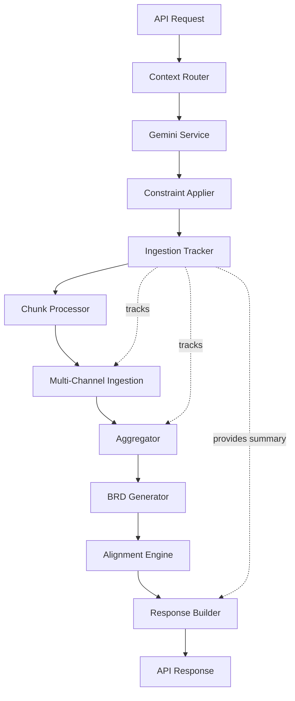

# Production Features - Design Document

## Overview

This design extends the ReqMind AI backend with three production-ready features:

1. **User Instruction Layer (Gemini Integration)**: Converts natural language instructions into structured constraints using Google's Gemini API to filter and prioritize ingested data
2. **Large Data Handling (Meeting Chunking)**: Implements intelligent text chunking for meetings exceeding 3000 words to avoid token limits
3. **Ingestion Transparency (Explainability)**: Tracks and reports what data sources were used in BRD generation

The design maintains backward compatibility with the existing `/generate_brd_with_alignment` endpoint while introducing a new `/generate_brd_with_context` endpoint that incorporates all three features.

---

## Architecture

### High-Level Flow

```
User Request (with instructions)
    ↓
[New Endpoint: /generate_brd_with_context]
    ↓
[Gemini Service] → Structured Constraints
    ↓
[Constraint Applier] → Filtered Data
    ↓
[Ingestion Tracker] → Start Tracking
    ↓
[Chunk Processor] → Detect & Chunk Large Texts
    ↓
[Multi-Channel Ingestion] → Extract Data (per chunk)
    ↓
[Aggregator] → Combine Chunk Results
    ↓
[BRD Generator] → Generate BRD
    ↓
[Alignment Intelligence] → Analyze Alignment
    ↓
[Response Builder] → Add Ingestion Summary
    ↓
Response (BRD + Alignment + Summary)
```

### Component Interaction



### Service Layer Architecture

The system follows a modular service-oriented architecture:

- **Gemini Service**: Handles Gemini API communication and constraint generation
- **Constraint Applier**: Filters and prioritizes data based on constraints
- **Chunk Processor**: Detects and chunks large texts
- **Ingestion Tracker**: Tracks data sources and processing metrics
- **Aggregator**: Combines results from multiple chunks
- **Existing Services**: BRD Generator, Alignment Intelligence, Multi-Channel Ingestion (unchanged)

---

## Components and Interfaces

### 1. Gemini Service

**Purpose**: Convert natural language instructions to structured constraints using Google Gemini API.

**Interface**:
```python
class GeminiService:
    def __init__(self, api_key: str, model: str = "gemini-pro", timeout: int = 10):
        """Initialize Gemini service with API credentials."""
        pass
    
    async def generate_constraints(self, instructions: str) -> Optional[Constraints]:
        """
        Convert natural language instructions to structured constraints.
        
        Args:
            instructions: Natural language instructions from user
            
        Returns:
            Constraints object or None if generation fails
            
        Raises:
            GeminiAPIError: If API call fails after retries
        """
        pass
    
    def _build_prompt(self, instructions: str) -> str:
        """Build prompt for Gemini API."""
        pass
    
    def _parse_response(self, response: str) -> Constraints:
        """Parse Gemini response into Constraints object."""
        pass
```

**Implementation Details**:
- Uses `google-generativeai` Python SDK
- Implements exponential backoff retry (2 retries, 1s, 2s delays)
- Timeout: 10 seconds per request
- Prompt engineering: Instructs Gemini to return JSON with specific schema
- Validation: Ensures returned JSON matches Constraints schema
- Error handling: Returns None on failure, logs error with request ID

**Prompt Template**:
```
You are a constraint extraction system. Convert the following user instructions into a JSON object with this exact structure:

{
  "scope": "string describing the project scope",
  "exclude_topics": ["list", "of", "topics", "to", "exclude"],
  "priority_focus": "string describing what to prioritize",
  "deadline_override": "string with deadline if mentioned, empty otherwise"
}

User Instructions: {instructions}

Return ONLY the JSON object, no additional text.
```

### 2. Constraint Applier

**Purpose**: Apply structured constraints to filter and prioritize ingested data.

**Interface**:
```python
class ConstraintApplier:
    def apply_constraints(
        self, 
        data: IngestionData, 
        constraints: Optional[Constraints]
    ) -> IngestionData:
        """
        Apply constraints to filter and prioritize data.
        
        Args:
            data: Raw ingestion data (emails, slack, meetings)
            constraints: Structured constraints from Gemini
            
        Returns:
            Filtered and prioritized IngestionData
        """
        pass
    
    def _filter_by_scope(self, text: str, scope: str) -> bool:
        """Check if text matches scope."""
        pass
    
    def _contains_excluded_topics(self, text: str, exclude_topics: List[str]) -> bool:
        """Check if text contains excluded topics."""
        pass
    
    def _calculate_priority_score(self, text: str, priority_focus: str) -> float:
        """Calculate priority score based on focus."""
        pass
```

**Implementation Details**:
- If constraints is None, returns data unchanged
- Filtering logic:
  - **Scope**: Uses keyword matching to check if content relates to scope
  - **Exclude Topics**: Removes items containing any excluded topic keywords
  - **Priority Focus**: Scores items based on keyword relevance, sorts by score
- Uses case-insensitive string matching
- Preserves original data structure
- Logs filtering statistics (items before/after, exclusion reasons)

### 3. Chunk Processor

**Purpose**: Detect large texts and split them into processable chunks.

**Interface**:
```python
class ChunkProcessor:
    def __init__(
        self, 
        threshold_words: int = 3000,
        chunk_size_min: int = 1000,
        chunk_size_max: int = 1500,
        overlap: int = 100
    ):
        """Initialize chunk processor with configuration."""
        pass
    
    def needs_chunking(self, text: str) -> bool:
        """Check if text exceeds threshold."""
        pass
    
    def chunk_text(self, text: str) -> List[TextChunk]:
        """
        Split text into overlapping chunks.
        
        Args:
            text: Input text to chunk
            
        Returns:
            List of TextChunk objects with metadata
        """
        pass
    
    def _split_at_sentence_boundary(self, text: str, target_pos: int) -> int:
        """Find nearest sentence boundary to target position."""
        pass
```

**Data Model**:
```python
@dataclass
class TextChunk:
    content: str
    chunk_index: int
    total_chunks: int
    word_count: int
    overlap_start: int  # Number of overlapping words from previous chunk
    overlap_end: int    # Number of overlapping words with next chunk
```

**Implementation Details**:
- Word counting: Uses `text.split()` for simplicity
- Chunking algorithm:
  1. Calculate total chunks needed: `ceil(word_count / chunk_size_avg)`
  2. For each chunk:
     - Start at previous chunk end minus overlap
     - Take chunk_size_max words
     - Find nearest sentence boundary (look for `. `, `! `, `? `)
     - If no boundary found within 200 chars, split at word boundary
  3. Add overlap metadata to each chunk
- Maintains speaker context in meeting transcripts (preserves `Speaker:` prefixes)
- Edge cases:
  - Text < threshold: Returns single chunk with no processing
  - Very short sentences: May result in chunks slightly outside size range
  - No sentence boundaries: Falls back to word boundaries

### 4. Ingestion Tracker

**Purpose**: Track data sources and processing metrics for transparency.

**Interface**:
```python
class IngestionTracker:
    def __init__(self, sample_count: int = 5):
        """Initialize tracker with sample size configuration."""
        pass
    
    def start_tracking(self) -> str:
        """Start a new tracking session, returns tracking_id."""
        pass
    
    def track_email(self, tracking_id: str, email: Email):
        """Track an email being processed."""
        pass
    
    def track_slack_message(self, tracking_id: str, message: SlackMessage):
        """Track a Slack message being processed."""
        pass
    
    def track_meeting(self, tracking_id: str, meeting: Meeting):
        """Track a meeting being processed."""
        pass
    
    def track_chunk(self, tracking_id: str, chunk: TextChunk):
        """Track a chunk being processed."""
        pass
    
    def get_summary(self, tracking_id: str) -> IngestionSummary:
        """
        Get ingestion summary for a tracking session.
        
        Returns:
            IngestionSummary with counts, samples, and metrics
        """
        pass
    
    def _select_samples(self, items: List[Any], count: int) -> List[Any]:
        """Select representative samples from items."""
        pass
```

**Data Model**:
```python
@dataclass
class IngestionSummary:
    emails_used: int
    slack_messages_used: int
    meetings_used: int
    total_chunks_processed: int
    total_words_processed: int
    processing_time_seconds: float
    sample_sources: List[SampleSource]

@dataclass
class SampleSource:
    type: Literal["email", "slack", "meeting"]
    metadata: Dict[str, Any]  # Type-specific metadata
```

**Implementation Details**:
- Thread-safe: Uses threading.Lock for concurrent requests
- Storage: In-memory dictionary keyed by tracking_id
- Sample selection: Random sampling with seed for reproducibility
- Processing time: Tracks from start_tracking() to get_summary()
- Cleanup: Tracking data expires after 1 hour (background cleanup task)
- Sample metadata:
  - **Email**: subject, date, sender
  - **Slack**: channel, user, timestamp, preview (first 50 chars)
  - **Meeting**: timestamp, topic, speakers list

### 5. Aggregator

**Purpose**: Combine extraction results from multiple chunks.

**Interface**:
```python
class Aggregator:
    def aggregate_chunks(
        self, 
        chunk_results: List[ExtractionResult]
    ) -> ExtractionResult:
        """
        Aggregate results from multiple chunks.
        
        Args:
            chunk_results: List of extraction results from each chunk
            
        Returns:
            Single aggregated ExtractionResult
        """
        pass
    
    def _deduplicate_requirements(self, requirements: List[str]) -> List[str]:
        """Remove duplicate requirements using similarity matching."""
        pass
    
    def _merge_decisions(self, decisions: List[Decision]) -> List[Decision]:
        """Merge decisions, keeping most recent."""
        pass
    
    def _merge_stakeholders(self, stakeholders: List[str]) -> List[str]:
        """Merge stakeholder lists, removing duplicates."""
        pass
    
    def _merge_timelines(self, timelines: List[Timeline]) -> List[Timeline]:
        """Merge timelines, resolving conflicts."""
        pass
```

**Implementation Details**:
- Deduplication strategy:
  - **Requirements**: Use fuzzy string matching (>80% similarity = duplicate)
  - **Decisions**: Keep decision with latest timestamp
  - **Stakeholders**: Simple set-based deduplication
  - **Timelines**: Keep earliest start date, latest end date per milestone
- Uses `difflib.SequenceMatcher` for similarity matching
- Preserves order: Earlier chunks take precedence for ordering
- Logs deduplication statistics

### 6. Context Router (New Endpoint)

**Purpose**: Handle `/generate_brd_with_context` endpoint requests.

**Interface**:
```python
@router.post("/generate_brd_with_context")
async def generate_brd_with_context(request: ContextRequest) -> ContextResponse:
    """
    Generate BRD with context-aware processing.
    
    Args:
        request: ContextRequest with instructions and data
        
    Returns:
        ContextResponse with BRD, alignment, and ingestion summary
    """
    pass
```

**Request/Response Models**:
```python
class ContextRequest(BaseModel):
    instructions: Optional[str] = None
    data: IngestionData

class ContextResponse(BaseModel):
    brd: BRD
    alignment_analysis: AlignmentAnalysis
    ingestion_summary: IngestionSummary
```

**Implementation Flow**:
1. Validate request
2. Generate constraints from instructions (if provided)
3. Apply constraints to filter data
4. Start ingestion tracking
5. Process each data source:
   - Check if chunking needed
   - Chunk if necessary
   - Extract data from each chunk
   - Track all sources
6. Aggregate chunk results
7. Generate BRD
8. Run alignment analysis
9. Build response with ingestion summary
10. Return response

---

## Data Models

### Constraints Model

```python
class Constraints(BaseModel):
    scope: str = ""
    exclude_topics: List[str] = []
    priority_focus: str = ""
    deadline_override: str = ""
    
    class Config:
        json_schema_extra = {
            "example": {
                "scope": "MVP features only",
                "exclude_topics": ["marketing", "internal discussions"],
                "priority_focus": "core functionality",
                "deadline_override": "June 2024"
            }
        }
```

### Ingestion Data Model

```python
class Email(BaseModel):
    subject: str
    body: str
    sender: str = ""
    date: str = ""

class SlackMessage(BaseModel):
    channel: str
    user: str
    text: str
    timestamp: str = ""

class Meeting(BaseModel):
    transcript: str
    topic: str = ""
    speakers: List[str] = []
    timestamp: str = ""

class IngestionData(BaseModel):
    emails: List[Email] = []
    slack_messages: List[SlackMessage] = []
    meetings: List[Meeting] = []
```

### Extraction Result Model

```python
class ExtractionResult(BaseModel):
    requirements: List[str]
    decisions: List[Decision]
    stakeholders: List[str]
    timelines: List[Timeline]

class Decision(BaseModel):
    description: str
    timestamp: str
    decision_maker: str = ""

class Timeline(BaseModel):
    milestone: str
    start_date: str = ""
    end_date: str = ""
    status: str = ""
```

---

## Correctness Properties

*A property is a characteristic or behavior that should hold true across all valid executions of a system—essentially, a formal statement about what the system should do. Properties serve as the bridge between human-readable specifications and machine-verifiable correctness guarantees.*


### Feature 1: User Instruction Layer

**Property 1: Instruction acceptance**
*For any* valid string input as instructions, the API should accept it without validation errors.
**Validates: Requirements 1.1.1**

**Property 2: Constraint generation validity**
*For any* natural language instructions, if Gemini successfully processes them, the resulting Constraints object should have valid JSON structure with all required fields (scope, exclude_topics, priority_focus, deadline_override).
**Validates: Requirements 1.1.2**

**Property 3: Constraint application invocation**
*For any* non-null Constraints object and IngestionData, applying constraints should modify the data (filter or reorder items).
**Validates: Requirements 1.1.3**

**Property 4: Topic exclusion**
*For any* data item containing text that matches an excluded topic, that item should not appear in the filtered results.
**Validates: Requirements 1.1.4**

**Property 5: Scope prioritization**
*For any* filtered data with scope constraints, items matching the scope should appear before items that don't match the scope.
**Validates: Requirements 1.1.5**

### Feature 2: Large Data Handling

**Property 6: Chunking threshold detection**
*For any* text, if its word count exceeds 3000, needs_chunking() should return True; otherwise False.
**Validates: Requirements 2.1.1**

**Property 7: Chunk size bounds**
*For any* text that is chunked, all chunks except possibly the last should have word counts between 1000 and 1500 words.
**Validates: Requirements 2.1.2**

**Property 8: Sentence boundary preservation**
*For any* chunked text, each chunk boundary (except the last) should end with a sentence-ending punctuation mark (., !, or ?) followed by whitespace or end of text.
**Validates: Requirements 2.1.4**

**Property 9: Chunk overlap consistency**
*For any* pair of adjacent chunks, the last 100 words of chunk N should match the first 100 words of chunk N+1.
**Validates: Requirements 2.1.5**

**Property 10: Extraction completeness**
*For any* chunk processed through extraction, the resulting ExtractionResult should contain all four required fields: requirements, decisions, stakeholders, and timelines (even if some are empty lists).
**Validates: Requirements 2.2.1**

**Property 11: Deduplication effectiveness**
*For any* set of chunk results containing duplicate requirements (>80% similarity), the aggregated result should contain fewer total requirements than the sum of all chunk results.
**Validates: Requirements 2.2.2**

**Property 12: Chunk tracking accuracy**
*For any* text that is chunked into N chunks, the ingestion tracker should record exactly N chunks processed.
**Validates: Requirements 2.2.5**

### Feature 3: Ingestion Transparency

**Property 13: Source counting accuracy**
*For any* processing session, the counts in the ingestion summary (emails_used, slack_messages_used, meetings_used, total_chunks_processed) should exactly match the number of items actually processed.
**Validates: Requirements 3.1.1, 3.1.2, 3.1.3, 3.1.4**

**Property 14: Sample size bounds**
*For any* tracking session with at least 5 sources, the sample_sources list should contain exactly 5 items; for sessions with fewer sources, it should contain all available sources.
**Validates: Requirements 3.2.1**

**Property 15: Sample metadata completeness**
*For any* sample source in the ingestion summary, it should include all required metadata fields for its type (email: subject + date, meeting: timestamp + topic, slack: channel + user + timestamp).
**Validates: Requirements 3.2.2, 3.2.3, 3.2.4**

---

## Error Handling

### Gemini Service Errors

**Error Types**:
- `GeminiAPIError`: API communication failures
- `GeminiTimeoutError`: Request exceeds timeout
- `GeminiRateLimitError`: Rate limit exceeded
- `ConstraintValidationError`: Invalid constraint format

**Handling Strategy**:
```python
try:
    constraints = await gemini_service.generate_constraints(instructions)
except GeminiTimeoutError as e:
    logger.warning(f"Gemini timeout: {e}, continuing without constraints")
    constraints = None
except GeminiAPIError as e:
    logger.error(f"Gemini API error: {e}, continuing without constraints")
    constraints = None
except ConstraintValidationError as e:
    logger.error(f"Invalid constraints: {e}, continuing without constraints")
    constraints = None
```

**Fallback Behavior**: If Gemini fails, continue processing without constraints (equivalent to no instructions provided).

### Chunking Errors

**Error Types**:
- `ChunkingError`: General chunking failure
- `TextTooShortError`: Text below minimum chunkable size

**Handling Strategy**:
```python
try:
    chunks = chunk_processor.chunk_text(text)
except ChunkingError as e:
    logger.error(f"Chunking failed: {e}, processing as single text")
    chunks = [TextChunk(content=text, chunk_index=0, total_chunks=1, ...)]
```

**Fallback Behavior**: Process entire text as single chunk if chunking fails.

### Tracking Errors

**Error Types**:
- `TrackingSessionNotFoundError`: Invalid tracking_id
- `TrackingStorageError`: Storage operation failure

**Handling Strategy**:
```python
try:
    summary = tracker.get_summary(tracking_id)
except TrackingSessionNotFoundError:
    logger.warning(f"Tracking session {tracking_id} not found")
    summary = IngestionSummary(...)  # Return empty summary
except TrackingStorageError as e:
    logger.error(f"Tracking storage error: {e}")
    summary = IngestionSummary(...)  # Return empty summary
```

**Fallback Behavior**: Return empty summary if tracking fails; don't block BRD generation.

### Aggregation Errors

**Error Types**:
- `AggregationError`: Aggregation logic failure
- `EmptyChunkResultsError`: No chunk results to aggregate

**Handling Strategy**:
```python
try:
    result = aggregator.aggregate_chunks(chunk_results)
except EmptyChunkResultsError:
    logger.error("No chunk results to aggregate")
    raise HTTPException(status_code=500, detail="Extraction failed")
except AggregationError as e:
    logger.error(f"Aggregation failed: {e}")
    # Return first chunk result as fallback
    result = chunk_results[0] if chunk_results else raise_error()
```

**Fallback Behavior**: Use first chunk result if aggregation fails.

### API Endpoint Errors

**Error Responses**:
```python
# 400 Bad Request - Invalid input
{
    "detail": "Invalid request format",
    "error_code": "INVALID_REQUEST"
}

# 500 Internal Server Error - Processing failure
{
    "detail": "BRD generation failed",
    "error_code": "GENERATION_FAILED",
    "request_id": "abc123"
}

# 503 Service Unavailable - Gemini API down
{
    "detail": "Constraint generation unavailable, processing without constraints",
    "error_code": "GEMINI_UNAVAILABLE",
    "fallback_applied": true
}
```

---

## Testing Strategy

### Dual Testing Approach

This feature requires both **unit tests** and **property-based tests** for comprehensive coverage:

- **Unit tests**: Verify specific examples, edge cases, and error conditions
- **Property tests**: Verify universal properties across all inputs using randomized testing

### Property-Based Testing Configuration

**Library**: Hypothesis (Python)

**Configuration**:
- Minimum 100 iterations per property test
- Each test tagged with feature name and property number
- Tag format: `# Feature: production-features, Property {N}: {property_text}`

**Example Property Test**:
```python
from hypothesis import given, strategies as st

@given(st.text(min_size=3001, max_size=10000))
def test_chunking_threshold_detection(text):
    """
    Feature: production-features, Property 6: Chunking threshold detection
    For any text, if its word count exceeds 3000, needs_chunking() should return True
    """
    processor = ChunkProcessor(threshold_words=3000)
    word_count = len(text.split())
    
    if word_count > 3000:
        assert processor.needs_chunking(text) == True
    else:
        assert processor.needs_chunking(text) == False
```

### Unit Testing Focus

**Unit tests should cover**:
- Specific examples demonstrating correct behavior
- Edge cases (empty inputs, boundary values, special characters)
- Error conditions (API failures, invalid inputs, timeouts)
- Integration points between components

**Unit tests should NOT**:
- Duplicate property test coverage with many similar examples
- Test every possible input combination (that's what property tests do)

### Test Coverage by Component

**Gemini Service**:
- Unit: API mocking, timeout handling, retry logic, error responses
- Property: Constraint generation validity (Property 2)

**Constraint Applier**:
- Unit: Empty constraints, empty data, specific filtering examples
- Property: Topic exclusion (Property 4), Scope prioritization (Property 5)

**Chunk Processor**:
- Unit: Exact threshold boundary (3000 words), empty text, single sentence
- Property: Threshold detection (Property 6), Chunk size bounds (Property 7), Sentence boundaries (Property 8), Overlap consistency (Property 9)

**Ingestion Tracker**:
- Unit: Thread safety, session expiration, empty data
- Property: Counting accuracy (Property 13), Sample size bounds (Property 14), Sample metadata (Property 15)

**Aggregator**:
- Unit: Empty chunk results, single chunk, specific deduplication examples
- Property: Deduplication effectiveness (Property 11), Extraction completeness (Property 10)

**Context Router**:
- Unit: Request validation, response format, backward compatibility
- Property: Instruction acceptance (Property 1)

### Integration Tests

**End-to-End Scenarios**:
1. Full flow with instructions → constraints → filtering → chunking → BRD
2. Large meeting (>3000 words) → chunking → aggregation → BRD
3. Multiple data sources → tracking → summary in response
4. Gemini failure → fallback → successful BRD generation
5. Backward compatibility: Old endpoint still works unchanged

### Performance Tests

**Benchmarks**:
- Gemini API call: < 2 seconds (mocked)
- Chunking 10,000 words: < 1 second
- Tracking overhead: < 100ms
- Full request with all features: < 5 seconds (excluding actual LLM calls)

---

## Configuration

### Environment Variables

```python
# config.py
from pydantic_settings import BaseSettings

class Settings(BaseSettings):
    # Existing
    OPENAI_API_KEY: str
    OPENAI_MODEL: str = "llama-3.3-70b-versatile"
    OPENAI_BASE_URL: str = "https://api.groq.com/openai/v1"
    
    # New - Gemini
    GEMINI_API_KEY: str
    GEMINI_MODEL: str = "gemini-pro"
    GEMINI_TIMEOUT: int = 10
    GEMINI_MAX_RETRIES: int = 2
    
    # New - Chunking
    CHUNK_THRESHOLD_WORDS: int = 3000
    CHUNK_SIZE_MIN: int = 1000
    CHUNK_SIZE_MAX: int = 1500
    CHUNK_OVERLAP: int = 100
    
    # New - Tracking
    SAMPLE_SOURCES_COUNT: int = 5
    TRACKING_SESSION_TTL: int = 3600  # 1 hour
    
    class Config:
        env_file = ".env"

settings = Settings()
```

### Dependency Injection

```python
# dependencies.py
from functools import lru_cache

@lru_cache()
def get_gemini_service() -> GeminiService:
    return GeminiService(
        api_key=settings.GEMINI_API_KEY,
        model=settings.GEMINI_MODEL,
        timeout=settings.GEMINI_TIMEOUT
    )

@lru_cache()
def get_chunk_processor() -> ChunkProcessor:
    return ChunkProcessor(
        threshold_words=settings.CHUNK_THRESHOLD_WORDS,
        chunk_size_min=settings.CHUNK_SIZE_MIN,
        chunk_size_max=settings.CHUNK_SIZE_MAX,
        overlap=settings.CHUNK_OVERLAP
    )

@lru_cache()
def get_ingestion_tracker() -> IngestionTracker:
    return IngestionTracker(
        sample_count=settings.SAMPLE_SOURCES_COUNT
    )
```

---

## Security Considerations

### Input Validation

**Instructions**:
- Maximum length: 2000 characters
- Sanitize before sending to Gemini (remove control characters)
- No code execution or injection attempts

**Data Sources**:
- Validate email/slack/meeting structure
- Maximum text length per item: 100,000 characters
- Maximum total items: 1000 per request

### API Key Security

- Store API keys in environment variables only
- Never log API keys
- Use separate keys for dev/staging/production
- Rotate keys regularly

### Logging Security

**Safe to log**:
- Request IDs
- Processing metrics (counts, times)
- Error types and messages

**Never log**:
- API keys
- Full email/slack content (only metadata)
- User instructions (may contain sensitive info)
- Full meeting transcripts

### Rate Limiting

```python
from slowapi import Limiter
from slowapi.util import get_remote_address

limiter = Limiter(key_func=get_remote_address)

@router.post("/generate_brd_with_context")
@limiter.limit("10/minute")  # 10 requests per minute per IP
async def generate_brd_with_context(request: ContextRequest):
    ...
```

---

## Deployment Considerations

### Backward Compatibility

**Existing Endpoint**: `/generate_brd_with_alignment`
- No changes to request/response format
- No changes to behavior
- Continues to work exactly as before

**New Endpoint**: `/generate_brd_with_context`
- Superset of old endpoint functionality
- Can be used without instructions (backward compatible behavior)
- Adds optional features (instructions, tracking)

### Migration Path

**Phase 1**: Deploy new endpoint alongside old endpoint
**Phase 2**: Update clients to use new endpoint
**Phase 3**: Monitor usage of old endpoint
**Phase 4**: Deprecate old endpoint (after 6 months)

### Monitoring

**Metrics to Track**:
- Gemini API success rate
- Gemini API latency
- Chunking frequency (% of requests requiring chunking)
- Average chunks per request
- Tracking overhead
- End-to-end latency
- Error rates by type

**Alerts**:
- Gemini API error rate > 10%
- Gemini API latency > 5 seconds
- End-to-end latency > 30 seconds
- Error rate > 5%

### Scaling Considerations

**Bottlenecks**:
- Gemini API rate limits (60 requests/minute)
- Chunking CPU usage for very large texts
- Tracking storage memory usage

**Mitigation**:
- Implement Gemini response caching (same instructions → cached constraints)
- Async chunking for multiple meetings
- Periodic cleanup of expired tracking sessions
- Consider Redis for tracking storage if memory becomes issue

---

## Future Enhancements

### Phase 2 Features

1. **Constraint Caching**: Cache Gemini responses for identical instructions
2. **Advanced Filtering**: ML-based relevance scoring instead of keyword matching
3. **Streaming Responses**: Stream BRD generation progress to client
4. **Chunk Parallelization**: Process chunks in parallel for faster processing
5. **Enhanced Tracking**: Track which specific sources contributed to which BRD sections

### Phase 3 Features

1. **Multi-LLM Support**: Allow users to choose between Gemini/GPT/Claude for constraints
2. **Custom Chunking Strategies**: Let users configure chunking parameters
3. **Explainability UI**: Visual dashboard showing data flow and filtering
4. **A/B Testing**: Compare BRD quality with/without constraints

---

## Appendix: Example Flows

### Example 1: Simple Request with Instructions

```
Request:
{
  "instructions": "Focus on MVP features only",
  "data": {
    "emails": [
      {"subject": "MVP scope", "body": "Core features..."},
      {"subject": "Future enhancements", "body": "Phase 2..."}
    ]
  }
}

Flow:
1. Gemini converts instructions → {"scope": "MVP features", "exclude_topics": ["phase 2", "future"]}
2. Constraint applier filters emails → Only "MVP scope" email remains
3. Tracker starts → tracking_id = "abc123"
4. No chunking needed (< 3000 words)
5. Groq extracts data from filtered email
6. BRD generated
7. Alignment analyzed
8. Response includes summary: {emails_used: 1, sample_sources: [...]}
```

### Example 2: Large Meeting with Chunking

```
Request:
{
  "data": {
    "meetings": [
      {"transcript": "... 5000 word transcript ..."}
    ]
  }
}

Flow:
1. No instructions → constraints = None
2. No filtering applied
3. Tracker starts → tracking_id = "def456"
4. Chunking detected (5000 > 3000 words)
5. Text split into 4 chunks (1200, 1300, 1250, 1250 words)
6. Each chunk processed by Groq → 4 ExtractionResults
7. Aggregator combines results → deduplicated ExtractionResult
8. BRD generated from aggregated data
9. Alignment analyzed
10. Response includes summary: {meetings_used: 1, total_chunks_processed: 4}
```

### Example 3: Gemini Failure Fallback

```
Request:
{
  "instructions": "Focus on mobile features",
  "data": {...}
}

Flow:
1. Gemini API call fails (timeout)
2. Log warning, set constraints = None
3. Continue processing without filtering
4. Normal flow continues
5. Response includes all data (no filtering applied)
6. Client receives successful response (degraded gracefully)
```

---

**Document Version**: 1.0  
**Created**: 2024-02-21  
**Status**: Draft - Ready for Review
